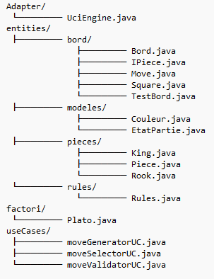

# R3_04 Projet
## Groupe :
- Maxime Courdavault 208
- Jean Francois Dena 208
- Tristan Pioton 208
- Moussa Wague 207
## MODE D’EMPLOI DE L’APPLICATION
### PRÉREQUIS
- Avant d’utiliser l’application, il est nécessaire d’avoir installé : CuteChess, Java, l’archive ZIP du projet R3_04.
- Décompresser l’archive dans un dossier de votre choix.
- Localiser java.exe en entrant commande suivante dans l’invite de commandes Windows : where java
- Repérer le chemin vers le fichier java.exe (exemple : C:\Users...\jdks\openjdk-24\bin\java.exe)
- Copier coller le fichier java.exe dans le dossier suivant du projet : R3_04_Projet-main\src\cutechess
### CONFIGURATION DE CUTECHESS
- Ouvrir CuteChess.
- Aller dans le menu : Tools → Settings → Engines
- Cliquer sur le bouton “+” en bas à gauche.
- Renseigner le chemin du fichier “monmoteur.bat” situé dans le dossier : R3_04_Projet-main\src\cutechess
- Cliquer sur OK.
- Fermer complètement CuteChess puis le rouvrir.
### LANCEMENT D’UNE PARTIE
- Dans CuteChess, créer une nouvelle partie.
- Sélectionner le moteur ajouté précédemment comme CPU.
- Entrer la position initiale suivante (FEN) : 4k3/6R1/8/8/2K5/8/8/8 w - - 0 1
- Valider avec OK.
- Profiter de la partie.
## INTRODUCTION
Le projet consiste à développer et tester un programme permettant  à deux joueurs de jouer une finale de type rrk aux échecs, c’est à dire une fin de partie dans laquelle les blancs ont un roi (King) et une tour (Rook) et les noirs un roi.
Le projet porte sur les principes SOLID, la Clean architecture, la programmation dirigée par les tests, le travail en équipe, et la gestion des versions avec git. Le GUI (Graphical User Interface) est fourni par un outil externe : CuteChess, via le protocole UCI. Pour ce faire, le projet a été implémenté en Java.  
## ARCHITECTURE

## DIAGRAMME

## BILAN
### Réussites vs Limites
Nous avons reussi a respecté la Clean Architecture et SOLID, la Communication complète avec CuteChess, la gestion du plateau, des règles du jeu, des pièces, tout nos tests sont passés et le code est extensible et documenté.
La gestion de l'interface de collaboration Github.
Nous avons appris l’importance d’une bonne architecture, la valeur des tests unitaires pour garantir la qualité, l’utilité des patterns de conception.
### Difficultés rencontrées
Nous avons eu des difficultés lors de la mise en relation entre CuteChess et notre projet car nous n’étions pas assez documenté et cela nous a pris plusieurs jours pour le faire fonctionner.
### Perspectives d'amélioration
Nous devons améliorer la création du Bord et faire en sorte qu'il soit charger en fonction de l'etat FEN entré au début d'une partie cutechess. 
